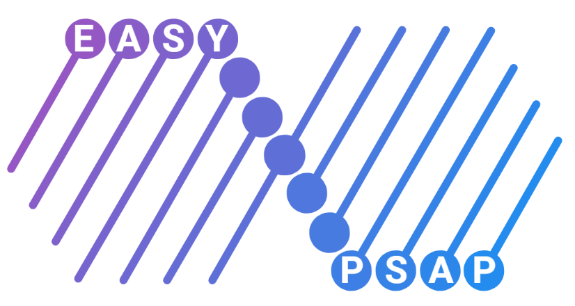
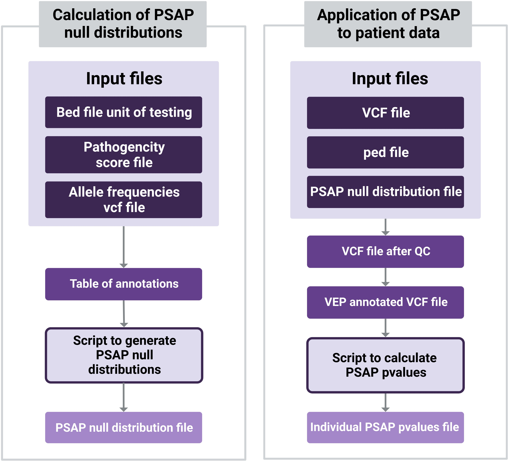

# Easy-PSAP: an integrated workflow to prioritize pathogenic variants in sequence data from a single individual

## Introduction
**Easy-PSAP** is a **[Snakemake](https://snakemake.readthedocs.io/en/stable/) workflow** [*Köster et al, 2012*] which allows the evaluation of genetic variants at the scale of a whole exome or genome. 
It is composed of two pipelines based on the Population Sampling Method (PSAP) method [*Wilfert et al, 2016*]. PSAP uses allele frequencies from large population databases to construct 
gene-based null distributions of CADD  pathogenicity scores [*Kircher et al, 2014*] and ultimately gives a p-value by gene for each individual, which summarizes how unlikely it is 
to observe a variant with such CADD score in the general population in this gene.

The first workflow **snakemake_makedistrib_PSAP** allows the custom calculation of PSAP null distributions from allele frequencies data and a pathogenicity score (CADD score or other).
The second workflow **snakemake_apply_PSAP** is a new implementation of the [initial PSAP pipeline](https://github.com/awilfert/PSAP-pipeline) which applies these null distributions to a vcf file
of a patient or multiple patients or controls.

Easy-PSAP aims at making the PSAP method accessible and user-friendly for both clinicians and researchers. A set of PSAP null distributions with the latest database information in GRCh37 is readily available
in the **/snakemake_apply_PSAP** directory, with global allele frequencies from the gnomAD V2 genome database [Karczewski et al 2020] and CADD v1.6 [Rentzsch et al 2021] as the pathogenicity score of variants. 
Easy-PSAP is currently implemented with genes as units of testing, and the option of using CADD regions is also available which allows the analysis of the whole genome and not just its coding parts.

## Workflows overview

This is a schematic representation of the two Snakemake workflows of Easy-PSAP, with their input and output files. 
Both pipelines can be used separately or in sequence: making PSAP null distributions according to a set of parameters and apply them to a vcf file. 



## Requirements

### Set up the conda environment 

Easy-PSAP requires the conda package manager to function. If it is not installed already, please see [bioconda installation instructions](https://docs.conda.io/projects/conda/en/latest/user-guide/install/index.html) to set it up.
Snakemake can then be installed through conda, as described in the [Snakemake installation instructions](https://snakemake.readthedocs.io/en/stable/getting_started/installation.html).

### Download Easy-PSAP repository from GitHub

Git clone command can be used to create a local copy of Easy-PSAP:

```
git clone https://github.com/msogloblinsky/Easy-PSAP.git
```

### Download large files for to run **snakemake_apply_PSAP**

Files too large to be hosted on GitHub can be dowloaded via this [link](https://lysine.univ-brest.fr/~msogloblinsky/share/). They are separated in two folders `example` and `data` that can directly be added to the `/snakemake_apply_PSAP/` folder to obtain the following configuration:

```
├── snakemake_apply_PSAP
│   ├── example
│   ├── data
│   ├── config
│   ├── slurm
│   ├── optional
│   ├── src
│   ├── envs
│   ├── README.md
└── └── Snakefile
```

Specific instructions to run each of the two pipeline can be found in their README.md file.

## References
* Köster, J. & Rahmann, S. Snakemake—a scalable bioinformatics workflow engine. Bioinformatics 28, 2520–2522 (2012)
* Wilfert, A. B. et al. Genomewide significance testing of variation from single case exomes. Nat Genet 48, 1455–1461 (2016)
* Kircher, M. et al. A general framework for estimating the relative pathogenicity of human genetic variants. Nat Genet 46, 310–315 (2014)
* Karczewski, K. J. et al. The mutational constraint spectrum quantified from variation in 141,456 humans. Nature 581, 434–443 (2020)
* Rentzsch, P., Schubach, M., Shendure, J. & Kircher, M. CADD-Splice—improving genome-wide variant effect prediction using deep learning-derived splice scores. Genome Medicine 13, 31 (2021)

## Contact

For any inquiries, please contact:
Marie-Sophie Ogloblinsky
marie-sophie.ogloblinsky@inserm.fr
UMR INSERM 1078 Genetic Functional Genomics and Biotechnologies 
Brest, FRANCE

## Acknowledgments 

Cloé Moëlo for creating the logos

Gaëlle Marenne for testing the pipeline

___


